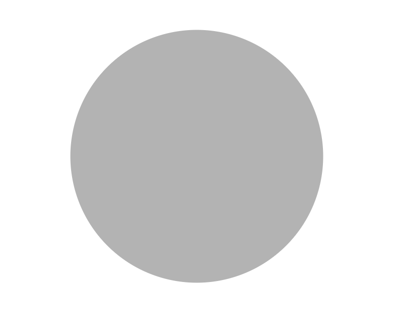

# Enspiraled

For this challenge, you'll be making a basic fractal generator that starts with a single large circle. As your mouse moves over the circle, four more circles appear. And each circle behaves this way.

After you've completed this project, this is what it can look like after a few mouse overs:


## Setup

### 0. Cloning and installation
- [ ] Clone this repo, navigate to it, install packages, and start the server with `npm run dev`
  <details style="padding-left: 2em">
    <summary>Tip</summary>

    ```sh
    cd enspiraled
    npm i
    npm run dev
    ```
  </details>

- [ ] Visit [http://localhost:3000](http://localhost:3000) in your browser
  <details style="padding-left: 2em">
    <summary>Tip</summary>

    This is what your starting place looks like:

    
  </details>

----

## Requirements

### 1. Getting situated

- [ ] Examine `client/components/App.jsx`
  <details style="padding-left: 2em">
    <summary>More about the <code>&lt;App&gt;</code> component</summary>

    Here are its contents:

    ```jsx
    import React from 'react'

    const App = props => {
      const circle = {
        cx: props.width / 2,
        cy: props.height / 2,
        level: 0,
        r: 256
      }

      return (
        <svg width={props.width} height={props.height}>
          <circle cx={circle.cx} cy={circle.cy} r={circle.r} />
        </svg>
      )
    }

    export default App
    ```

    The `App` component is implemented as a stateless functional component. The `props` are defined in `client/index.js`, if you're curious. We use the width and height of the window to center the circle in the browser. This component renders [Scalable Vector Graphics](https://developer.mozilla.org/en-US/docs/Web/SVG): an `<svg>` element with an SVG `<circle>` element in it. It has a radius of 256px (`r`) and is filled with a translucent grey established in `server/public/css/app.css`. It's important to note that this JSX will render The SVG elements, **not React controls**. We know this because `<svg>` and `<circle>` are lower case.
  </details>

### 2. Interacting with circles

- [ ] As your mouse moves over the circle, four more circles should appear at the cardinal compass points: north, south, east and west

- [ ] The radius of the 4 new circles should be half of the **parent** circle

- [ ] A circle should only create 4 new children **once**. Subsequent mouseovers should create no visible change

---

## Things to consider

<details>
  <summary>Guidance on completing the challenge</summary>
  
  - If you don't already have it installed, you should install the React DevTools browser extension ([Firefox](https://addons.mozilla.org/en-US/firefox/addon/react-devtools/) and [Chrome](https://chrome.google.com/webstore/detail/react-developer-tools/fmkadmapgofadopljbjfkapdkoienihi?hl=en)). This will add a tab in Developer Tools that will allow you to explore the [virtual DOM](http://tonyfreed.com/blog/what_is_virtual_dom) used by React

  - Because every circle behaves the same way, you could create a new `Circle` component in `client/components/Circle.jsx` that wraps the SVG `<circle>` element and adds some new features (like state)

  - When a `<Circle>` is showing itself, it should use the SVG `<circle>` element, but when it's showing it's children, it should use new `<Circle>` components

  - The `<Circle>` component should keep its child circles as an array in state. It will only have children if it has been moused over

  - You can apply a mouseover event to the SVG `circle` element like this:
    ```<circle cx={cx} cy={cy} r={r} mouseover={handleMouseOver} />```
    The `handleMouseOver` function can be defined in the same `Circle.jsx` file

  - Once you've got the functionality, have fun with new colours for each generation!
</details>

---

## Further reading

<details>
  <summary>More reading</summary>

  * [SVG](https://developer.mozilla.org/en/docs/Web/SVG)
  * [SVG `circle`](https://developer.mozilla.org/en-US/docs/Web/SVG/Element/circle)
  * [React Component](https://facebook.github.io/react/docs/reusable-components.html)
  * [React's `useState`](https://reactjs.org/docs/hooks-reference.html#usestate)
  * [Color](https://developer.mozilla.org/en/docs/Web/CSS/color_value)
</details>

---
[Provide feedback on this repo](https://docs.google.com/forms/d/e/1FAIpQLSfw4FGdWkLwMLlUaNQ8FtP2CTJdGDUv6Xoxrh19zIrJSkvT4Q/viewform?usp=pp_url&entry.1958421517=enspiraled)
